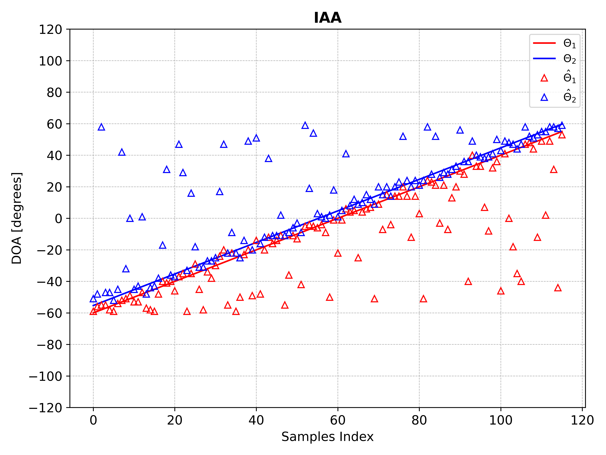

# DoAMoE

  📍 This is an official PyTorch implementation **[MSEDOA: Enhancing DOA Estimation with Multiscale Squeeze-and-Excitation Networks for Automotive Millimeter-Wave Radar](https://github.com/Armorhtk/MSEDOA)**

## 📰 News

**[2024.0830]** Model checkpoints and training logs are released! [best_model.pth](https://pan.baidu.com/s/1BEAkIe6uEQlNMh6o9CkI9w?pwd=an2c) should be placed in`checkpoints/Model20240825181151` to reproduce the experimental results.

**[2024.0825]** Code and paper of MSEDOA are released! 


## 💡 Methodology 
 

For DOA estimation, the MSEDOA framework integrates multi-scale feature extraction, channel attention mechanisms, and SE-ResNet, all of which are essential for capturing the complex nonlinear relationships between raw signals and their corresponding DOAs.

## 🛠️ Setup
**Step1:** create a new conda environment.

```bash
git clone https://github.com/Armorhtk/MSEDOA.git
cd MSEDOA
conda create -n MSEDOA python==3.9.0
conda activate MSEDOA
pip install requestments.txt
```
**Tips:** We test the framework using pytorch=2.4.0, and the CUDA compile version=12.2 Other versions should be also fine but not totally ensured.

**Step2:** Generate simulation data.

If you need to use the same dataset as in the paper, you can download the 1.27GB `data_ongrid_250k` dataset from the [Baidu Cloud Link](https://pan.baidu.com/s/1CsVr9gfivB6YcYrI3aC82w?pwd=5dkp).

```bash
python data_gen.py 
  --folder_path './data_ongrid_100k' \
  --number_elements 12 \
  --val_num_samples 180000 \ 
  --val_num_samples 20000 \
  --max_targets 3 \
  --snapshot 10 \
  --min_angle -60 \
  --max_angle 60 \
  --SumlationSEED 42
```
The data is stored in the `data_ongrid_100k` folder with two sub-folders `train` and `Val` for the signal and label tensor data under different SNR.


## ⏳ Training

```bash
python train.py 
```

Run `train. py` to obtain the best model. 
**Notice:** To reproduce completely consistent results, load the released weights of the best model in `checkpoints` folder and proceed directly to the Evaluation stage

## 🔖 Evaluation

**Experiment A:** Testing the DOA estimation performance of the DOAMOE method. The finished program allows you to view the results in the image folder. Set the signal-to-noise ratio (SNR) to 12 dB. $\theta_1$ ranges from [-60, 55] degrees, and $\theta_2$ is 4.7° apart from $\theta_1$. Test the performance and error of different DOA estimation methods on the same simulation data.

```bash
python Evaluation_Performance.py 
```
DOA Performance            |  DOA Errors
:------------------------:|:-------------------------:
         | 
        | 
      | 
  | 
        | 

**Experiment B:** Testing the DOA estimation performance of difference SNR. The finished program allows you to view the results in the image folder. Set the signal-to-noise ratio range -20 to 30 dB. $\theta_1$ ranges $[-60^{\circ},53^{\circ}]$ to create a more realistic continuous angular distribution, and $\theta_2$ is 6.1° apart from $\theta_1$. Test the performance and error of different DOA estimation methods on the same simulation data.


```bash
python Evaluation_SNR4RMSE.py
```


## 📜Citation

If you find this work helpful for your project,please consider citing the following repository:

```bibtex
@misc{Armorhtk2024doa,
  title = {MSEDOA: Enhancing DOA Estimation with Multiscale Squeeze-and-Excitation Networks for Automotive Millimeter-Wave Radar},
  author = {Tingkai Hu and Shuang Sun and Zhenyu Wu and Chuandong Li and Hailing Xiong and Luo Zhen},
  publisher = {GitHub},
  url = {https://github.com/Armorhtk/MSEDOA},
  year = {2024},
}
```

## 🙏 Acknowledgement

- [SENet](https://github.com/hujie-frank/SENet)
